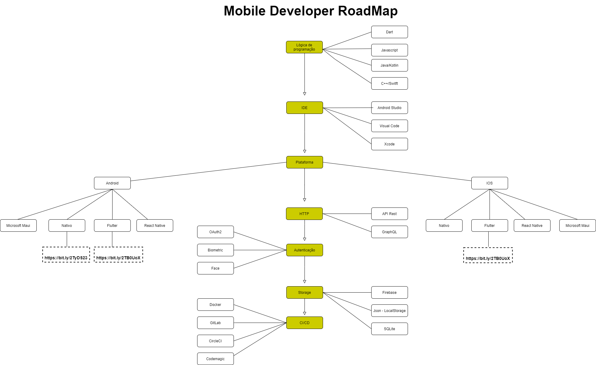

# Mobile Developer Roadmap 2020

## Propósito

 > O Propósito desse roadmap é para desenvolevdores iniciantes que desejam saber o que é necessário conhecer para se tornar um desenvolvedor mobile.

## Roadmap

## Referências

1. [Flutter Roadmap](https://github.com/Tarikul711/flutter-development-roadmap)
2. [Android Roadmap](https://github.com/olexale/flutter_roadmap)
3. [IOS Roadmap](https://github.com/BohdanOrlov/iOS-Developer-Roadmap)
4. [React Native](https://github.com/adam-golab/react-developer-roadmap)

## Atenção

O conteúdo aqui desenvolvido ainda tem muito para ser melhorado. Caso tenha interesse, mande um PR com atualizações.
Para editar o diagrama basta acessar https://www.draw.io/ e importar o arquivo assets/roadmap.drawio
